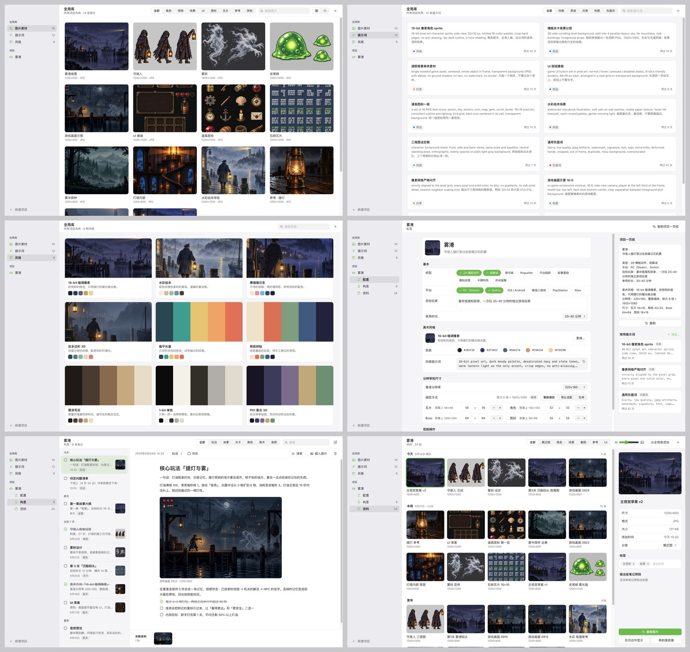

# GamePanl

**游戏策划工作台（macOS）。** 把一款游戏从立项到开发过程中的构思笔记、图片素材、生图提示词、美术风格和基础配置放在同一个地方，按项目归档；任何一张卡片单击即复制，直接粘贴到 ChatGPT、Gemini、Photoshop 或引擎里。

> A macOS desktop workbench for indie game planning — per-project notes, art references, AI image prompts, style guides and specs, with click-to-copy everywhere. Built with Electron, React and TypeScript.



## 它解决什么问题

一个人做游戏，思路会在美术、玩法结构、参考图、截图之间来回跳：参考图散在下载文件夹，提示词躺在聊天记录里，设定写在各处的备忘录。GamePanl 只做一件事：**把这些东西放进去、理清楚、用的时候一键拿出来。** 它不是引擎，不接 API，也不替你生图。

## 功能

**全局库**（所有项目共用，是你自己积累的资产）

- **图片素材**：拖入、粘贴或选择文件导入，按内容去重；分类、标签、搜索；网格 / 列表两种视图；单击卡片复制原图到系统剪贴板，悬停的眼睛按钮打开预览。
- **提示词**：按风格 / 用途 / 约束 / 构图 / 负面词分类，单击复制并记录使用次数，可直接编辑。
- **风格**：名称、描述、五色色板、样张和对应的生图提示词；单击复制提示词，点色块复制色值。

**项目**（一款游戏一个，是策划本，不是引擎工程）

- **配置**：类型、平台、目标玩家、单局时长、美术风格（从全局库选）、基准分辨率与缩放方式、瓦片 / 角色 / Boss / 图标尺寸、常用提示词；右侧实时生成可复制的「项目一页纸」。
- **构思**：备忘录式笔记，按玩法 / 故事 / 关卡 / 角色 / 美术 / 音频分类，可打勾完成，正文支持清单和图片块。
- **资料**：本项目的图片，照片式网格按时间分组，可从全局库添加；右侧检查器改名称、分类、标签，并显示被哪些笔记引用。

**操作方式**和 macOS 原生应用一致：单击卡片复制，双击打开查看 / 编辑，右键有完整菜单（查看、复制、用默认应用打开、在访达中显示、改分类、添加到项目、移到废纸篓），⌘ / ⇧ 点击多选后可以批量改分类或删除，Delete 删除、⌘C 复制、⌘A 全选；图片还能直接**拖出**到访达、ChatGPT、Photoshop。菜单栏有 新建项目 ⌘N、新建笔记 ⇧⌘N、添加图片 ⌘I、查找 ⌘F、检查更新。

**界面**参考 macOS 原生应用：访达式侧栏（毛玻璃）、统一工具栏、系统设置式分组表单、分段控件；跟随系统的深浅色和强调色，记住窗口位置。

## 安装

**直接下载**：到 [Releases](https://github.com/TgolMsk/GamePanl/releases/latest) 下载 dmg，Apple 芯片选 `GamePanl-<版本>-arm64.dmg`，Intel 选 `-x64.dmg`，打开后把 GamePanl 拖进「应用程序」。

> 安装包目前没有 Apple 开发者签名。第一次打开如果提示「无法验证开发者」或「已损坏」：在访达里右键 GamePanl → 打开，或到 系统设置 → 隐私与安全性 里点「仍要打开」；也可以在终端执行 `xattr -cr /Applications/GamePanl.app`。

**从源码运行**（需要 Node.js 20+）：

```bash
git clone https://github.com/TgolMsk/GamePanl.git
cd GamePanl
npm install
npm run dev
```

首次启动会出现欢迎页，点「导入示例内容」可以看到示例项目「雾港」：14 张示例图片、12 条提示词、9 种风格、9 条策划笔记和 24 张项目资料。

自己打包：`npm run dist`，产物在 `release/`。

## 在线更新

应用会按 GitHub Releases 的版本号检查更新：启动 8 秒后检查一次，之后每 6 小时一次；也可以在菜单 **GamePanl → 检查更新…** 手动检查。有新版本时侧栏底部会出现提示，点开能看到更新说明，「下载更新」会把对应芯片的 dmg 下载到「下载」文件夹，下载完直接打开安装包替换即可。可以「跳过这个版本」，或在更新窗口里关掉自动检查。

预发布版本（tag 带 `-beta` 等后缀）不会推送给正式用户。

## 数据存放

所有数据都是本地普通文件，默认在 `~/GamePanl/`（可用环境变量 `GAMEPANL_DATA_ROOT` 改）：

```
~/GamePanl/
  library/
    images/<id>.<ext>        原图
    images.json  prompts.json  styles.json
  projects/<projectId>/
    project.json             配置
    notes/<noteId>.md        笔记（文件头字段 + Markdown 正文）
    assets/<id>.<ext>        项目资料原图
    assets.json
  .cache/thumbs/             缩略图缓存，删了会重建
```

在访达里就能看懂，也方便用 git 或网盘自己备份。删除操作一律移到系统废纸篓。

## 技术栈

Electron 44 · electron-vite 5 · Vite 7 · React 19 · TypeScript · zustand。主进程负责存储、图片导入去重、缩略图（`gp://` 协议）、系统剪贴板；界面只通过 `window.gp` 访问数据（接口契约见 [`src/shared/api.ts`](src/shared/api.ts)）。

## 目录

```
src/main/        主进程：存储、IPC、gp:// 图片协议、示例内容
src/preload/     contextBridge，暴露 window.gp
src/renderer/    界面：ui/ 基础组件、app/ 状态与钩子、screens/ 四个界面
src/shared/      类型与接口契约
resources/sample 示例内容（图片由 GPT 生成，提示词见 design-assets/chatgpt-prompts.md）
build/           应用图标
docs/            开发说明、界面原型、截图
```

开发说明见 [docs/DEV-BRIEF.md](docs/DEV-BRIEF.md)。

## 发布新版本

```bash
npm version 0.2.0        # 改 package.json 版本，生成提交和 v0.2.0 标签
git push --follow-tags   # 推送后 GitHub Actions 自动构建 dmg / zip 并创建 Release
```

Release 创建后，所有用户的应用都会检测到新版本。工作流见 [`.github/workflows/release.yml`](.github/workflows/release.yml)，它会校验 package.json 的版本和 tag 一致，并用 `--generate-notes` 从提交记录生成更新说明（发布后可以在 GitHub 上再改）。

## 路线

- [x] 全局库：图片素材 / 提示词 / 风格
- [x] 项目：配置 / 构思 / 资料
- [x] 单击复制、预览、深浅色、系统强调色
- [x] 在线更新（GitHub Releases 版本检测 + 下载安装包）
- [ ] 图文思维导图（故事线、关卡结构）
- [ ] 全局搜索（⌘K）
- [ ] Windows 支持

## 说明

示例图片和应用图标由 GPT 图像模型生成，仅作示例。项目处于早期版本，欢迎提 issue。
